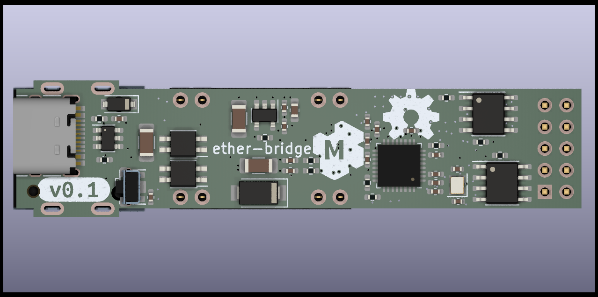

---

Ether-bridge

NOTE: This is only a prototype now, so things might not work, and everything might change 

This hardware is meant as an Ethernet upgrade for devices that only support
I2C/UART/RS485/CAN communications. This should be used with a device-specific
firmware that exposes SCPI commands for all functions of a particular device.

Basic target features:

* Ethernet connection
* PoE .af 12w
* CAN
* RS-485
* i2c/UART
* 1x GPIO
* LXI/SCPI support via raw TCP
* Compatibility with ESPHome and Home Assistant

Dev NOTE: before commit, run `./kibot.sh` to regenerate documentation, bom, gerbers and other assets.

* [schematics.pdf](gen/schematics.pdf)
* [pcb.pdf with dimensions](gen/pcb.pdf)
* [ibom.html](gen/single/ibom.html)

---

